# 🎬 Real-Time Video Watch-Time Tracker

A sophisticated video progress tracking system designed for online learning platforms that accurately measures unique video consumption, prevents gaming through skipping, and provides persistent progress tracking.


---

## 📋 Table of Contents

- [Overview](#overview)
- [Key Features](#key-features)
- [System Architecture](#system-architecture)
- [Core Concepts](#core-concepts)
- [How It Works](#how-it-works)
- [Component Breakdown](#component-breakdown)
- [Industry Applications](#industry-applications)
- [Getting Started](#getting-started)
- [API Reference](#api-reference)

---

## Overview

Traditional video players track progress linearly, allowing users to skip to the end and mark content as "complete." This tracker solves that problem by monitoring **actual unique segments watched**, ensuring learners genuinely engage with content before receiving completion credit.

### The Problem with Traditional Tracking

```
Traditional: User skips to 95% → Shows 95% complete ❌
This System: User skips to 95% → Shows only actually watched segments ✅
```

---

## Key Features

| Feature | Description |
|---------|-------------|
| 🎯 **Interval-Based Tracking** | Tracks exact start/end times of watched segments |
| 🔄 **Intelligent Merging** | Combines overlapping intervals to prevent double-counting |
| ⏭️ **Skip Detection** | Automatically detects when users skip ahead or back |
| 💾 **Persistent Storage** | Saves progress to localStorage (upgradeable to cloud) |
| 📊 **Visual Progress** | Shows watched vs unwatched segments on progress bar |
| 🔄 **Resume Capability** | Users can continue from where they left off |
| 🎨 **Beautiful UI** | Modern, responsive design with smooth animations |

---

## System Architecture

### High-Level Architecture

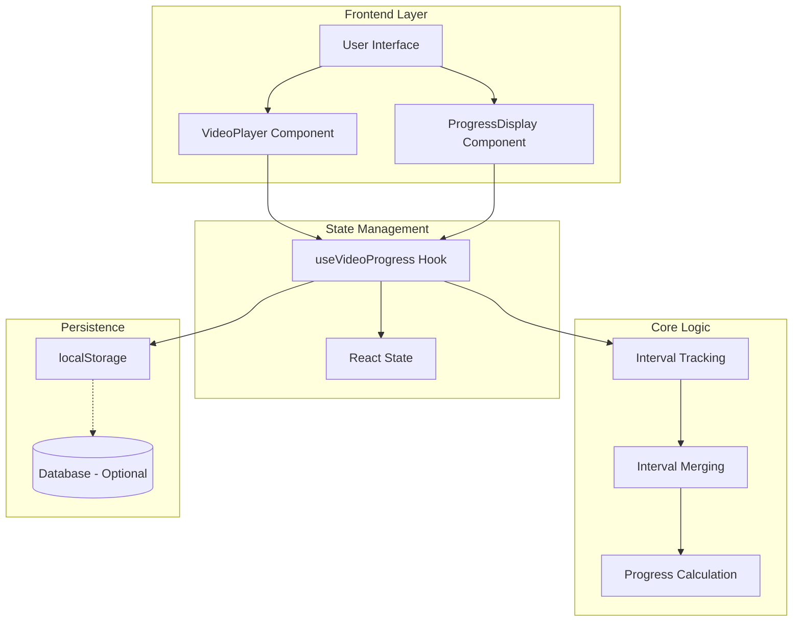

### Data Flow Diagram

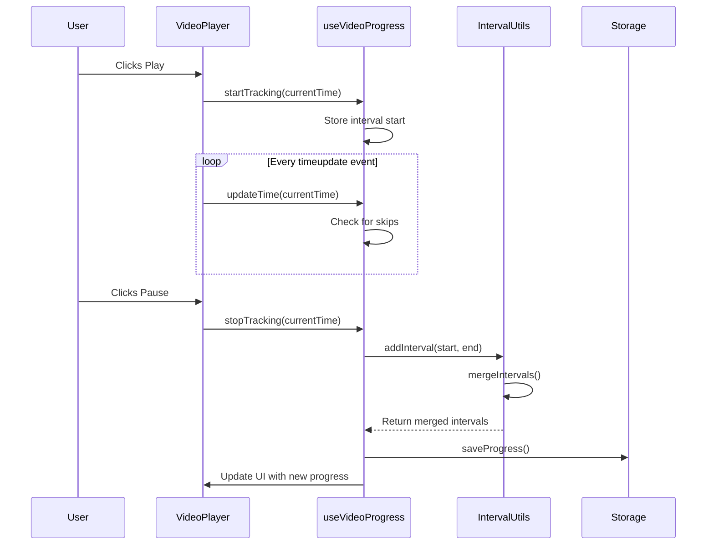

---

## Core Concepts

### 1. Interval-Based Tracking

Instead of tracking a single "current position," we track **intervals** (segments) of watched content.

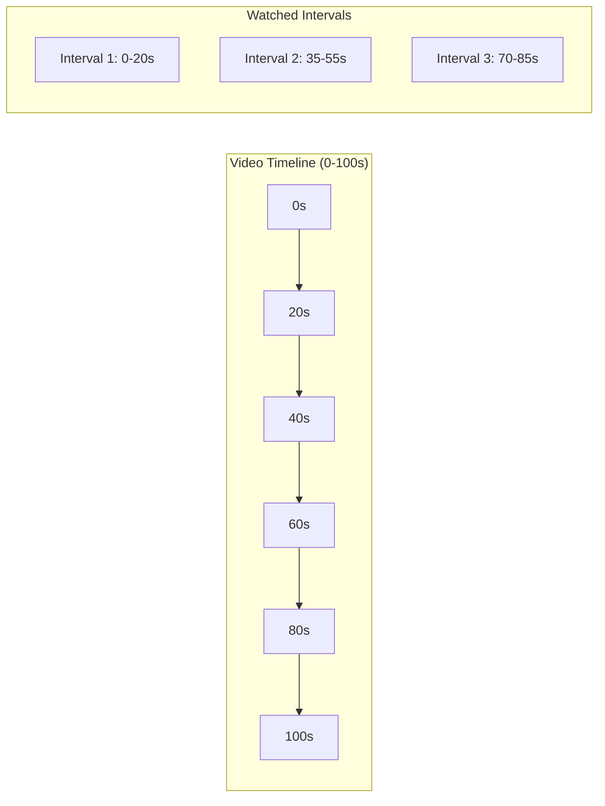

**Data Structure:**
```javascript
// Each interval represents a watched segment
const interval = {
  start: 0,    // Start time in seconds
  end: 20     // End time in seconds
};

// Collection of all intervals
const intervals = [
  { start: 0, end: 20 },
  { start: 35, end: 55 },
  { start: 70, end: 85 }
];
```

### 2. Interval Merging Algorithm

When intervals overlap or are adjacent, they're merged to prevent double-counting.

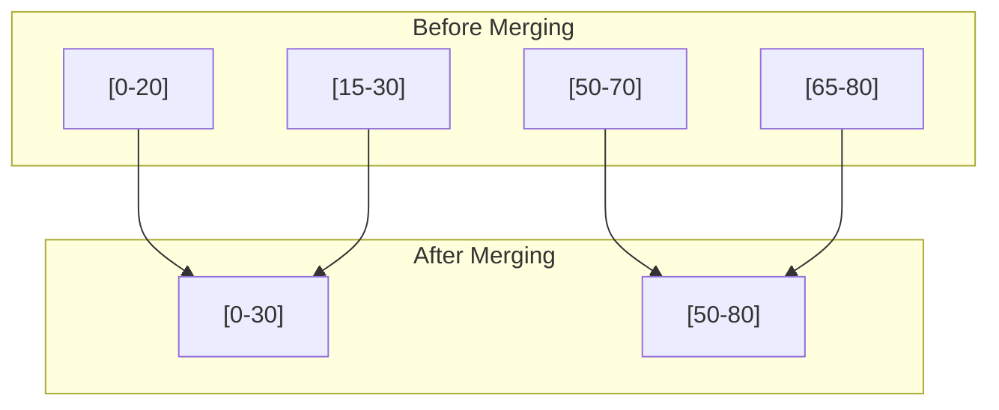

**Algorithm Logic:**
```javascript
function mergeIntervals(intervals) {
  // 1. Sort by start time
  const sorted = [...intervals].sort((a, b) => a.start - b.start);
  
  // 2. Iterate and merge overlapping
  const merged = [sorted[0]];
  for (let i = 1; i < sorted.length; i++) {
    const current = sorted[i];
    const last = merged[merged.length - 1];
    
    if (current.start <= last.end) {
      // Overlap - extend the interval
      last.end = Math.max(last.end, current.end);
    } else {
      // No overlap - add new interval
      merged.push(current);
    }
  }
  return merged;
}
```

### 3. Skip Detection

The system detects when users skip by monitoring time jumps between updates.

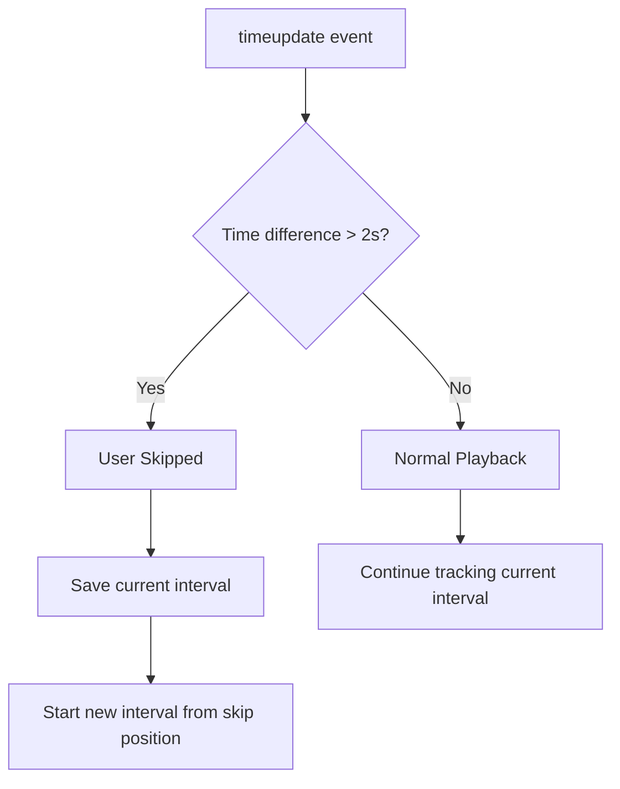

### 4. Progress Calculation

Progress is calculated from **unique seconds watched**, not current position.

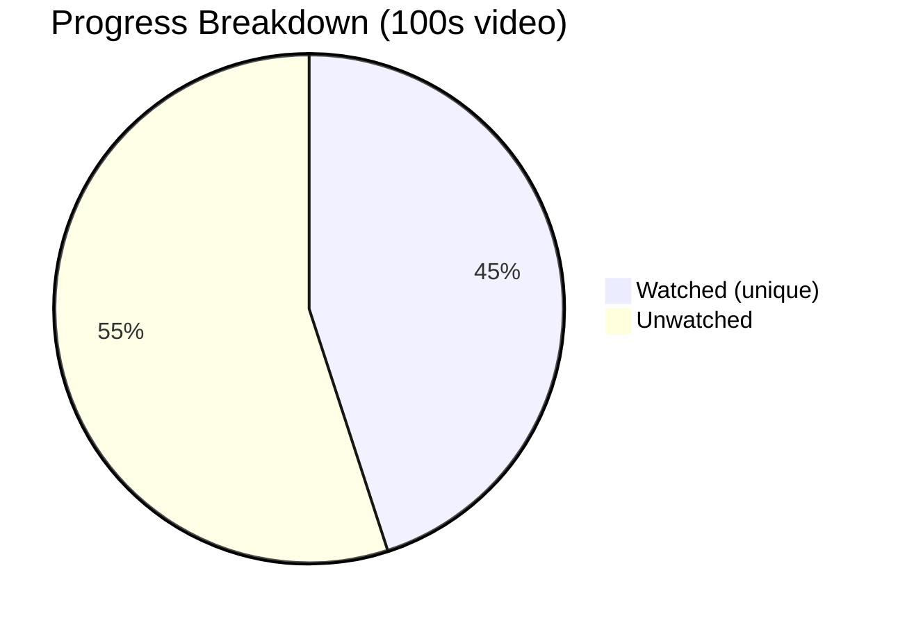

**Formula:**
```
Progress % = (Total Unique Seconds Watched / Video Duration) × 100
```

---

## How It Works

### Complete User Journey

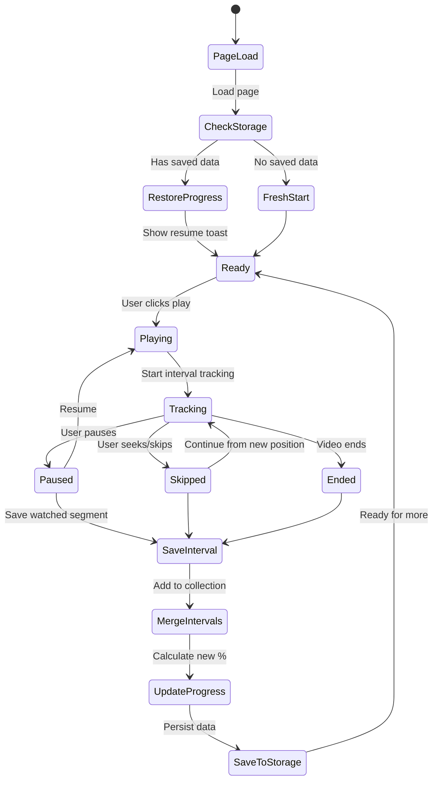

### Event Handling Flow

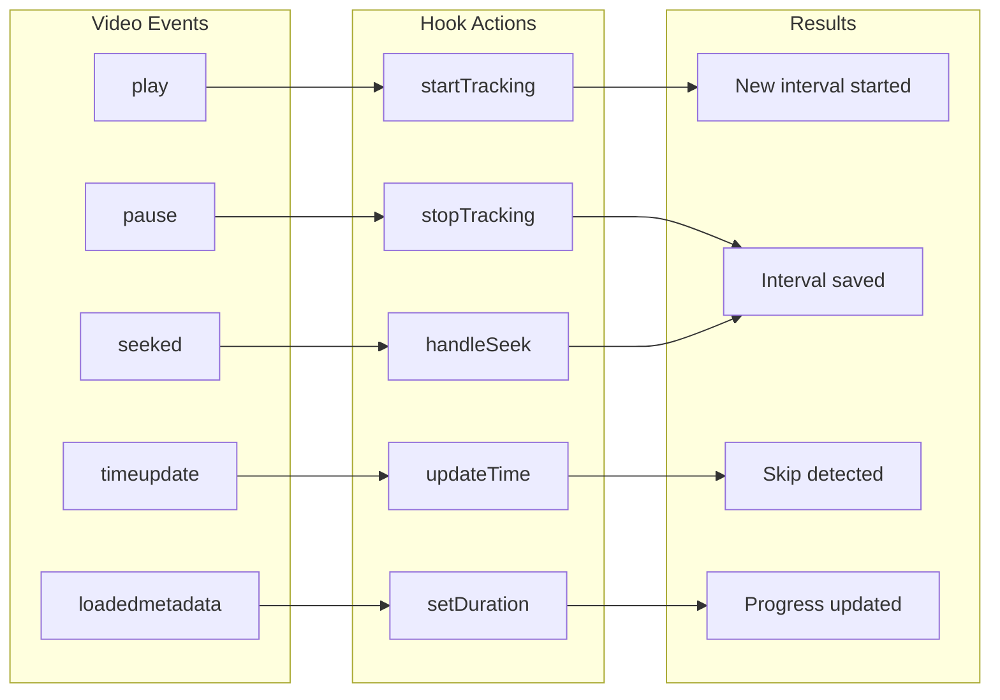

---

## Component Breakdown

### 1. VideoPlayer Component

Handles video playback and user interactions.

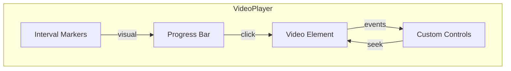

**Responsibilities:**
- Render HTML5 video element
- Custom play/pause/volume/fullscreen controls
- Progress bar with click-to-seek
- Visual indicators for watched segments
- Auto-hide controls during playback

### 2. useVideoProgress Hook

Central state management for progress tracking.

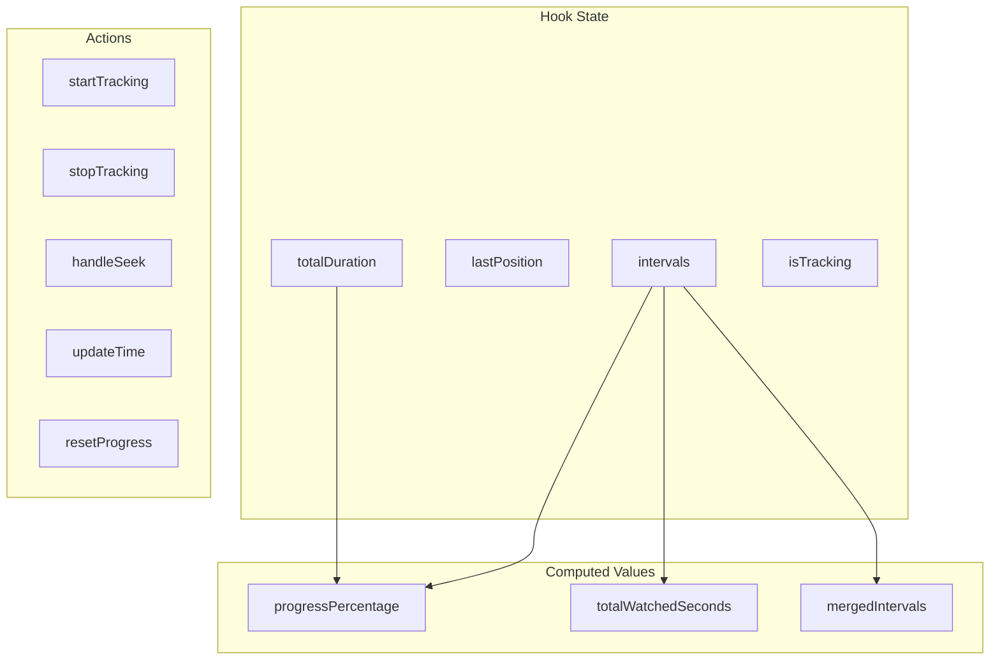

### 3. ProgressDisplay Component

Visual representation of learning progress.

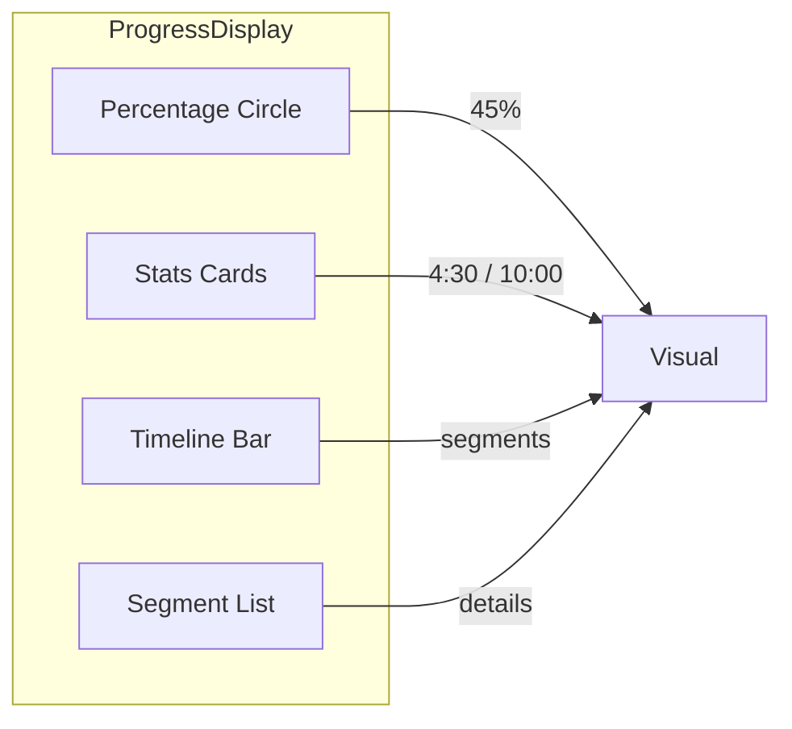

### 4. IntervalUtils Library

Pure utility functions for interval operations.

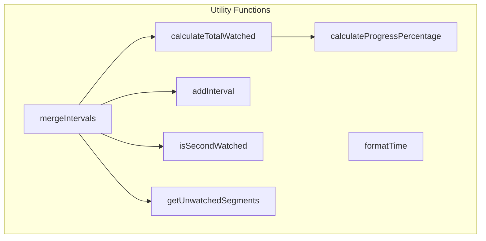

---

## Industry Applications

### How Leading Platforms Can Use This

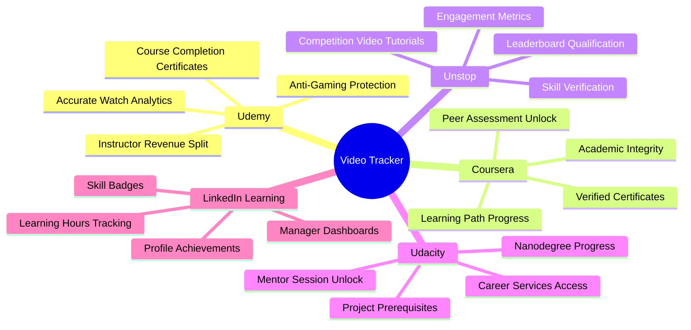

### Platform-Specific Use Cases

#### 🎓 Udemy
| Use Case | Implementation |
|----------|----------------|
| **Completion Certificates** | Issue certificates only when 100% unique content watched |
| **Refund Protection** | Track actual engagement vs. quick skimmers |
| **Instructor Analytics** | Show which sections students skip most |
| **Revenue Attribution** | Fair pay based on actual content consumption |

#### 🏆 Unstop (formerly Dare2Compete)
| Use Case | Implementation |
|----------|----------------|
| **Competition Prerequisites** | Require tutorial completion before contest entry |
| **Skill Verification** | Verify candidates watched training content |
| **Engagement Scoring** | Factor watch behavior into rankings |
| **Sponsor Metrics** | Accurate view counts for sponsor content |

#### 🎯 Udacity
| Use Case | Implementation |
|----------|----------------|
| **Nanodegree Gates** | Unlock projects only after watching prerequisites |
| **Mentor Sessions** | Require content completion before booking mentors |
| **Career Services** | Grant access after completing career modules |
| **Progress Reports** | Accurate weekly progress emails to students |

#### 📚 Coursera
| Use Case | Implementation |
|----------|----------------|
| **Verified Certificates** | Academic integrity through verified watching |
| **Peer Review Unlock** | Complete lectures before reviewing others |
| **Specialization Progress** | Accurate course completion tracking |
| **Enterprise Reporting** | Detailed employee learning analytics |

#### 💼 Corporate L&D (Learning & Development)
| Use Case | Implementation |
|----------|----------------|
| **Compliance Training** | Ensure employees watch required content |
| **Onboarding Verification** | Track new hire training completion |
| **Audit Trails** | Detailed logs for regulatory compliance |
| **ROI Measurement** | Actual engagement vs. content investment |

---

## Getting Started

### Prerequisites

- Node.js 18+ 
- npm or bun

### Installation

```bash
# Clone the repository
git clone <your-repo-url>

# Navigate to project
cd video-watch-tracker

# Install dependencies
npm install

# Start development server
npm run dev
```

### Project Structure

```
src/
├── components/
│   ├── VideoPlayer.jsx      # Video player with custom controls
│   ├── ProgressDisplay.jsx  # Progress visualization
│   ├── LectureHeader.jsx    # Lecture info display
│   └── ResetProgressButton.jsx
├── hooks/
│   └── useVideoProgress.js  # Core tracking hook
├── lib/
│   └── intervalUtils.js     # Interval algorithms
├── pages/
│   └── Index.jsx            # Main page
└── index.css                # Design system
```

---

## API Reference

### useVideoProgress Hook

```javascript
const {
  intervals,           // Merged watched intervals
  progressPercentage,  // 0-100 completion percentage
  totalWatchedSeconds, // Total unique seconds watched
  totalDuration,       // Video duration in seconds
  lastPosition,        // Last playback position
  isTracking,          // Currently tracking playback
  startTracking,       // Start interval (on play)
  stopTracking,        // End interval (on pause)
  handleSeek,          // Handle seek events
  updateTime,          // Update current time
  setDuration,         // Set video duration
  resetProgress,       // Clear all progress
} = useVideoProgress('video-id');
```

### Interval Utilities

```javascript
import {
  mergeIntervals,           // Merge overlapping intervals
  calculateTotalWatched,    // Get total unique seconds
  calculateProgressPercentage, // Get completion %
  addInterval,              // Add new interval
  isSecondWatched,          // Check if second was watched
  formatTime,               // Format seconds to MM:SS
  getUnwatchedSegments,     // Get unwatched parts
} from '@/lib/intervalUtils';
```

---

## Extending the System

### Adding Cloud Persistence

Replace localStorage with Supabase/Firebase:

```javascript
// In useVideoProgress.js
const saveProgress = async (intervals, position, duration) => {
  await supabase
    .from('video_progress')
    .upsert({
      user_id: userId,
      video_id: videoId,
      intervals: intervals,
      last_position: position,
      total_duration: duration,
      updated_at: new Date()
    });
};
```

### Adding Analytics Events

```javascript
// Track engagement metrics
const trackEngagement = (event, data) => {
  analytics.track(event, {
    video_id: videoId,
    progress: progressPercentage,
    watched_seconds: totalWatchedSeconds,
    ...data
  });
};
```

---

## License

MIT License - Feel free to use in your projects!

---

<p align="center">
  Built with ❤️ using React + Vite + Tailwind CSS by Shrestha Kundu
</p>

